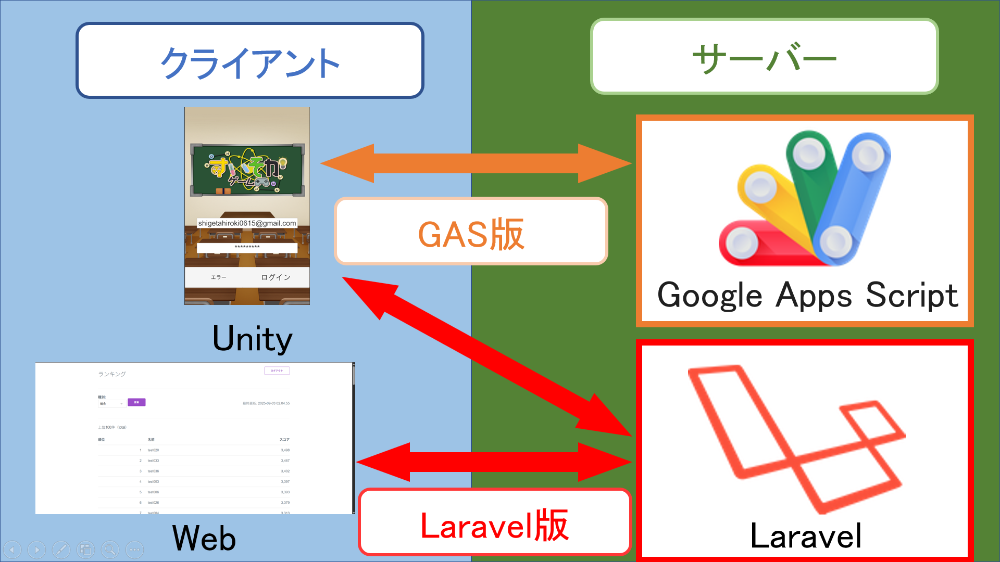

# すいそかゲーム(Laravelランキング)

> **学校内ゲームジャム制作作品（2025年7月）**  
> 元素を繋げてスコアを競う、スマートフォン向けのカジュアルパズルゲーム。  
> Google Sheets と Laravel を活用したオンラインランキング機能を実装しています。

---

##  概要

- **ゲーム制作期間**：2024年7月（3日間）
- **Laravelランキング制作期間**:2025年7月~9月
- **チーム構成**：3名（企画1名、デザイン1名、プログラム1名［担当：自分］）  
- **ランキング制作**：個人担当
- **ジャンル**：スマートフォン向けパズルゲーム  
- **特徴**：
  - Laravelを用いたランキング機能  
  - オンラインアカウント管理とスコア送信処理を自作APIで実装  
  - Laravelフレームワークを用いたWebの作成

---

##  開発環境

| 項目 | 内容 |
|------|------|
| **OS** | Windows / AlmaLinux |
| **開発環境** | Unity 2022.3.22f1 / Laravel / Visual Studio / VS Code |
| **開発言語** | C#（Unity）, PHP（Laravel）, HTML / CSS|

---
## クライアントとサーバーの通信構成図

---

## 主要ファイルと機能説明

| スクリプト名 | 内容 |
| ---- |---- |
|**AuthController.php** | ユーザー登録・ログイン・トークン管理|
|**RankingController.php** | API経由でランキングデータを返す |
|**ScoreController.php** | スコア送信API |
|**AccountController.php** | Web版アカウント削除処理 |
|**WebAuthController.php** | Webログイン／ログアウト処理 |
|**WebRankingController.php** | Webランキングページ表示 |
|**GenerateRankings.php** | 日・月・総合ランキングを自動集計するコマンド |
|**Ranking.php** | ランキングモデル |
|**Score.php** | スコアモデル |
|**User.php** | ユーザーモデル |
|**RankingRebuilder.php** | ランキング再構築サービス（スコアから集計） |
|**api.php** | Unityクライアント向けAPIルート定義 |
|**web.php** | Web向けルート定義 |
|**app.blade.php** | Web共通レイアウト |
|**login.blade.php** |ログイン画面 |
|**index.blade.php** | ランキング表示画面 |
|**2025_07_09_020957_create_scores_table.php** |スコアテーブル定義 |
|**2014_10_12_000000_create_users_table.php** | ユーザーテーブル定義 |
|**2019_12_14_000001_create_personal_access_tokens_table.php** | Sanctumトークンテーブル定義 |

---

## Laravelランキング機能の概要

Laravelを用いてAPIサーバーを構築し、Unityクライアントと通信しています。

### 主な機能

- メールアドレス＋パスワードでのアカウント登録／ログイン
- Laravel Sanctum によるAPIトークン発行と認証
- Unity側でAES暗号化してトークン保持
- データベースにスコアを保存し、Web上からもランキング閲覧可能
- 上位50件（Unity）／100件（Web）まで表示対応

---

## Webランキング機能（Laravel連携）

- クライアントで作成したアカウントでWebログイン可能
- 総合・月間・デイリー の切り替え表示
- 自分の順位をハイライト表示
- アカウント削除機能（Web限定）
- 最大100件のランキング閲覧対応

---

## 技術的ポイント

- Laravel Sanctum を用いたトークンベース認証
- DB設計とAPI設計を自作（スコア・ユーザー・ランキング）
- Laravel Blade + Milligram CSS による軽量Web UI構築
- Artisanコマンドでの自動ランキング集計（再実行しても冪等）

### ポートフォリオページ

**詳細・スクリーンショットはこちら**
https://shigetahiroki-portfolio.netlify.app/project2
